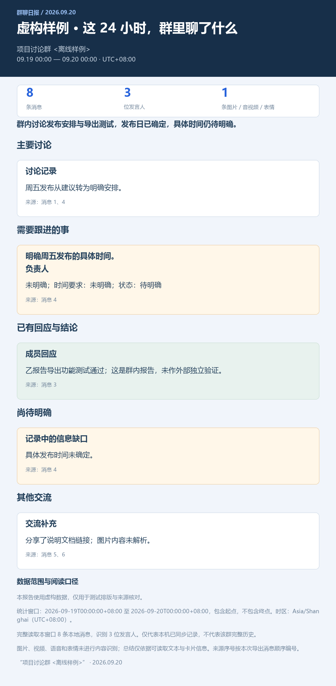

# 微信群聊日报 · WeChat Group Digest

一个可复用的 Codex 技能：读取本人电脑微信中指定群聊的本地已同步记录，由当前 Codex 会话完整阅读并总结，自动生成可分享的 PNG 长图、离线 HTML 和 Markdown。

包含实际读取、校验和渲染代码。**CLI 的导出命令不是独立 AI 总结器**：总结由 Codex 会话完成，无需额外模型 API Key。仓库不包含真实聊天记录或数据库密钥。

## 安装为技能

需要 Windows x64、Python 3.13、已登录的本人微信和 Codex。已验证微信版本为 **4.1.13.65**；其他版本不保证兼容。

```powershell
# 如果设置了 CODEX_HOME，使用该目录；否则使用用户目录下的 .codex。
$codexRoot = if ($env:CODEX_HOME) { $env:CODEX_HOME } else { Join-Path $env:USERPROFILE '.codex' }
$skillPath = Join-Path $codexRoot 'skills\wechat-group-digest'
git clone https://github.com/Ans2024/wechat-group-digest.git $skillPath
& "$skillPath\scripts\setup.ps1"
```

目录已存在时先检查已有安装，不要覆盖个人修改。在 Codex 中调用：

> 使用 $wechat-group-digest，总结“我的群聊完整名称”最近24小时的消息，生成PNG和网页版日报。

支持最近 48、72 小时及指定起止时间。缺少群名时技能会询问；多个账号或同名群需要明确选择。

## 工作方式

1. 只读定位指定账号数据库，校验密钥、数据库页和 WAL。
2. 固定统计截止时间，按完整群名和 `[start,end)` 范围完整导出。
3. Codex 分批阅读全部消息，生成有实际消息 ID 和原文证据的总结。
4. 渲染深蓝标题、浅灰背景、分区卡片式 HTML 和 PNG，核对统计与来源。
5. 分享报告不展示群 ID、个人微信 ID 或账号目录；内部结构化数据保留核对字段。

每次生成独立输出目录：

| 文件 | 用途 |
| --- | --- |
| `messages.json`、`messages.txt` | 本地核对消息，含私人数据，不应公开上传 |
| `report.json` | 结构化总结、消息引用及阅读清单 |
| `summary.md` | 中文总结 |
| `index.html` | 无需服务器、CDN 或外部字体的离线网页 |
| `report.png` | 中文长图；过长时生成全部编号分图 |

## 虚构示例

```powershell
Set-Location $skillPath
.\.venv\Scripts\python.exe -m wechat_local demo --output outputs/demo-validation
.\.venv\Scripts\python.exe -m unittest discover -v
```

下面的预览全部由虚构消息生成：



## 命令行

```powershell
Set-Location $skillPath
$env:PYTHONIOENCODING = 'utf-8'
.\.venv\Scripts\python.exe -m wechat_local accounts
.\.venv\Scripts\python.exe -m wechat_local export --group '完整群名' --hours 24
# 自定义范围（北京时间；包含起点、不包含终点）
.\.venv\Scripts\python.exe -m wechat_local export --group '完整群名' --start '2026-09-20T09:00:00+08:00' --end '2026-09-21T09:00:00+08:00'
# Codex 完整阅读导出并生成 report.json 后：
.\.venv\Scripts\python.exe -m wechat_local render 'outputs/本次目录'
```

本技能会继续执行总结和渲染，不只导出。手动运行 `export` 则需要另外让 Codex 生成 `report.json`。格式见 [报告约定](references/report-contract.md)。

## 已知限制

- 仅本地已同步记录，不等于完整群历史。无法据此证明手机端同步完整。
- 原始数据库只读；连续两次相同的 DB/WAL 读取是乐观静止快照，不是跨分片原子事务。
- 相关数据库容器整体在内存中解密并校验，查询只针对选定群和时间窗口。大库可能需要数 GB 内存。
- 不保存数据库密钥或临时明文数据库。尽力覆盖可变密钥缓冲区，无法保证 Python、SQLite 或操作系统的所有内存副本被安全擦除。
- 图片、视频、语音和表情未做内容识别；只使用实际可读取的文本、卡片和有来源的已有转写。
- 显示联系人备注或昵称，未解析群专属昵称。
- HMAC/WAL 校验失败或客户端结构变化时停止，不猜偏移、忽略错误或伪造读取成功。
- 开发者真实验证样本未触发有效 WAL 合并；WAL 已有构造测试及 SQLite 实际生成日志的重放测试，不等于所有微信版本均验证。
- 中文 PNG 使用 Windows 微软雅黑；目前不支持 macOS/Linux 直接读取流程。
- 不自动发送群消息、上传聊天记录、部署公网或创建定时任务。

测试覆盖精确匹配、时间边界、去重、认证页、WAL 提交边界、引用、HTML 转义、媒体密钥脱敏及中断清理。浏览器 QA 脚本 `verify_html.py` 使用本机 Edge 验证离线页面；普通 PNG 渲染不需要浏览器。

## 故障排查

密钥未找到：保持本人账号登录，检查 Python 为 64 位以及运行权限与微信一致；必要时从管理员 PowerShell 运行。微信更新后不能保证对象布局继续兼容。多账号使用 `--account` 指定，同名群用 `--group-id` 消歧。

快照持续变化或 WAL 校验失败：稍后重试，不强行忽略校验。输出目录已存在：改用新目录，避免混入旧报告。

请不要在 issue、提交或日志中粘贴真实数据库、密钥、聊天记录或账号信息。

## 许可证与来源

Apache-2.0，详见 [LICENSE](LICENSE)、[NOTICE](NOTICE) 和 [THIRD_PARTY.md](THIRD_PARTY.md)。读取实现参考的两个上游均固定了提交；本项目补充了逐页认证、WAL 校验和/提交边界、内存数据生命周期和报告流程。
